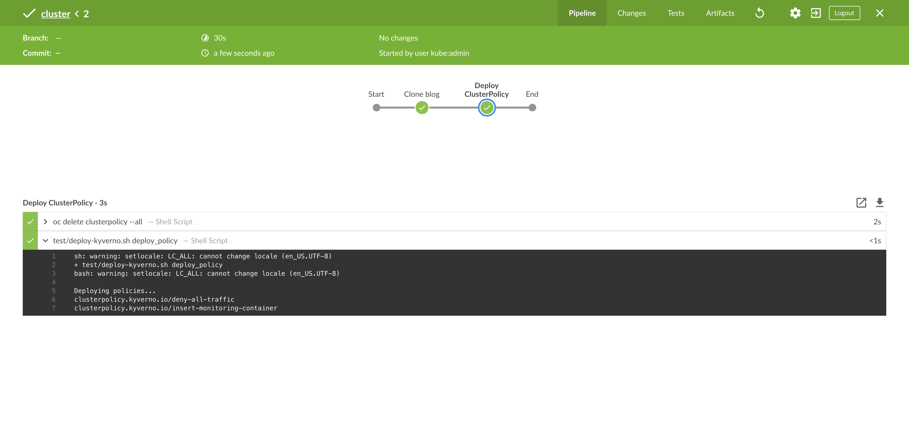
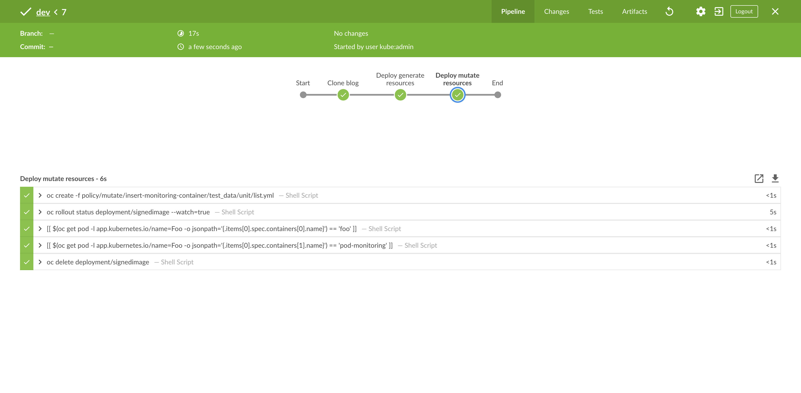

[]()

[](https://github.com/garethahealy/kyverno-mutate-generate-blog/actions/workflows/tests.yaml)

# Mutations of a resource on OpenShift with Kyverno
In previous blog posts, I've looked into how [Kyverno](https://kyverno.io/) can be used to [validate resources](https://cloud.redhat.com/blog/automate-your-security-practices-and-policies-on-openshift-with-kyverno), 
as well as [verify images](https://cloud.redhat.com/blog/software-supply-chain-security-on-openshift-with-kyverno-and-cosign). 
In the final blog of this series on Kyverno, we will look at another feature that provides mutating and generating resources.

## Mutate
[Mutating resources](https://kyverno.io/docs/writing-policies/mutate) is the ability to add, replace or remove a stanza from
a resource that is processed via the Kubernetes API. A common mutation pattern is adding a sidecar container to all pods to offer
a capability pre-built in, such as monitoring, without any interaction from the developer:

```yaml
1	apiVersion: kyverno.io/v1
2	kind: ClusterPolicy
3	metadata:
4	  name: insert-monitoring-container
5	spec:
6	  rules:
7	  - name: insert-monitoring-container
8	    match:
9	      resources:
10	        kinds:
11	        - Pod
12	    mutate:
13	      patchesJson6902: |-
14	        - op: add
15	          path: "/spec/containers/1"
16	          value: {"name":"pod-monitoring","image":"registry.acme.com/pod-monitoring:latest"}
```

Let's go line by line and explain what each bit is doing:
- _line 1 to 2_: declares what type of resource it is, which in this example is cluster-wide
- _line 3 to 4_: is defining the metadata about the policy
- _line 7_: is the name of the rule
- _line 8 to 11_: is defining the resources, which this policy should match against
- _line 13_: is the type of patch used to update the resource
- _line 14 to 16_: is the [patch](http://jsonpatch.com/) operation

## Generate
[Generating resources](https://kyverno.io/docs/writing-policies/generate/) is the ability to create an additional resource when a
parent resource is created or updated via the Kubernetes API. A common generation pattern is adding a `NetworkPolicy` 
when a `Namespace` is created, allowing for security policies to be applied by default:

```yaml
1	apiVersion: kyverno.io/v1
2	kind: ClusterPolicy
3	metadata:
4	  name: deny-all-traffic
5	spec:
6	  rules:
7	  - name: deny-all-traffic
8	    match:
9	      resources:
10	        kinds:
11	        - Namespace
12	        selector:
13	          matchLabels:
14	            redhat-cop.github.com/internal: "true"
15	    generate:
16	      kind: NetworkPolicy
17	      name: deny-all-traffic
18	      namespace: "{{request.object.metadata.name}}"
19	      data:
20	        spec:
21	          # select all pods in the namespace
22	          podSelector: {}
23	          policyTypes:
24	          - Ingress
25	          - Egress
```

Let's go line by line and explain what each bit is doing:
- _line 1 to 14_: are similar to the above mutate policy, except for one addition. In this policy, we are only interested in `namespaces` with the label `redhat-cop.github.com/internal`
- _line 16 to 18_: is defining the type of object we will generate and where
- _line 19 to 25_: is resource definition of the `NetworkPolicy` we will create in every namespace, which has the label `redhat-cop.github.com/internal`

## Cool, How Do I Run Them?
To run the above policies, it is expected the following tools are installed:
- [bats-core](https://github.com/bats-core/bats-core#installation), which is a testing framework that will execute `oc`.
- [jq](https://stedolan.github.io/jq/download), which is used by the BATS framework to process JSON files.
- [yq](https://pypi.org/project/yq), which is used by the BATS framework to process YAML files.

You can execute the above policies by running the below commands.
_NOTE_: A user with cluster-admin permissions is required to deploy Kyverno.

```bash
git clone https://github.com/garethahealy/kyverno-mutate-generate-blog.git
cd kyverno-mutate-generate-blog

echo "Firstly, Let's have a look at the test data..."
cat policy/generate/deny-all-traffic/test_data/unit/list.yml
cat policy/mutate/insert-monitoring-container/test_data/unit/list.yml

echo "Let's have a look at the policies..."
cat policy/generate/deny-all-traffic/src.yaml
cat policy/mutate/insert-monitoring-container/src.yaml

echo "Let's have a look at the BATS tests..."
cat test/kyverno-integrationtests.sh

echo "Now, let's deploy kyverno (cluster-admin permissions required with a valid session)..."
test/deploy-kyverno.sh deploy_kyverno

echo "Now, let's deploy the kyverno policies..."
test/deploy-kyverno.sh deploy_policy

echo "Finally, let's check the policy is active for our namespace..."
bats test/kyverno-integrationtests.sh
```

So what did the above do?
- You executed `test/deploy-kyverno.sh deploy_kyverno`, which deployed Kyverno onto your cluster in the `kyverno` namespace.
- You executed `test/deploy-kyverno.sh deploy_policy`, which applied the `ClusterPolicy` Kyverno CRs to your cluster.
- You executed `test/kyverno-integrationtests.sh`, which used `BATS` to run `oc create` which validated the policy worked as expected on-cluster.

If you are unable to install the software required, you can [fork](https://github.com/garethahealy/kyverno-mutate-generate-blog.git) my GitHub repository
which contains an [action](https://github.com/garethahealy/kyverno-mutate-generate-blog/actions/workflows/tests.yaml?query=is%3Asuccess) that runs the above
on commit. So why not have a tinker in your own little playground.

## OK, But How Do I Fit These Policies Into My CI/CD Pipeline?
The following example presumes you are using a Jenkins deployed onto your cluster via:

```bash
oc new-project jenkins
oc process jenkins-persistent -p DISABLE_ADMINISTRATIVE_MONITORS=true -p MEMORY_LIMIT=2Gi -n openshift | oc create -n jenkins -f -
oc rollout status dc/jenkins --watch=true -n jenkins
```

Firstly, let's allow the `jenkins` service account to create Kyverno policies:

```bash
oc adm policy add-cluster-role-to-user kyverno:admin-policies system:serviceaccount:jenkins:jenkins
```

And create projects, so we can test the `deny-all-traffic` generate policy:

```bash
oc create -f jenkins/project-admin-role.yml -n jenkins
oc adm policy add-cluster-role-to-user project-admin system:serviceaccount:jenkins:jenkins
```

Next, let's open Jenkins and create two new pipeline jobs. The first is for our `cluster-admin` who
controls the policies:

```groovy
node ("maven") {
    stage("Clone blog") {
        sh "git clone https://github.com/garethahealy/kyverno-mutate-generate-blog.git"
    }

    stage("Deploy ClusterPolicy") {
        dir("kyverno-mutate-generate-blog") {
            sh "oc delete clusterpolicy --all"
            sh "test/deploy-kyverno.sh deploy_policy"
        }
    }
}
```

Which once triggered should give you similar output to:



The second is for our developers who will be creating resources that might trigger the policies:

```groovy
node ("maven") {
    stage("Clone blog") {
        sh "git clone https://github.com/garethahealy/kyverno-mutate-generate-blog.git"
    }

    stage("Deploy generate resources") {
        try {
            dir("kyverno-mutate-generate-blog") {
                sh "oc create -f policy/generate/deny-all-traffic/test_data/unit/list-ocp.yml"
                sh "[[ \$(oc get networkpolicy -n kyverno-undertest-denyalltraffic -o name) == 'networkpolicy.networking.k8s.io/deny-all-traffic' ]]"
            }
        } finally {
            sh "oc delete project/kyverno-undertest-denyalltraffic --wait=false"
        }
    }

    stage("Deploy mutate resources") {
        try {
            dir("kyverno-mutate-generate-blog") {
                sh "oc create -f policy/mutate/insert-monitoring-container/test_data/unit/list.yml"
                sh "oc rollout status deployment/signedimage --watch=true"

                sh "[[ \$(oc get pod -l app.kubernetes.io/name=Foo -o jsonpath='{.items[0].spec.containers[0].name}') == 'foo' ]]"
                sh "[[ \$(oc get pod -l app.kubernetes.io/name=Foo -o jsonpath='{.items[0].spec.containers[1].name}') == 'pod-monitoring' ]]"
            }
        } finally {
            sh "oc delete deployment/signedimage"
        }
    }
}
```

This should give you a similar output to the below, which shows our deployment containing two containers:



## Just Because You Can, Does Not Mean You Should
_"Just because you can, does not mean you should"_ is a common phrase used in the IT sector when a new piece of software is released 
and everyone attempts to adopt it for every use case imaginable, even if it is not the best fit.

For example, if you are following a GitOps deployment model to create namespaces, using the `generate` policies might be counter-intuitive, 
as they are competing concepts. On one hand, you are expressing what your namespace should look like in `git` but then have a policy
which changes this, which feels like a _"code smell"_.

With that said, I think there are a number of good use cases where these types of policies can fit into the lifecycle of your cluster
but as always, it depends on what you are currently doing to fully understand if it is the best solution for your requirements.